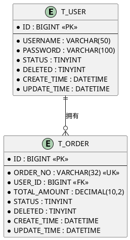

# database-designer

## 输入

- **用户故事**: 需求分析阶段输出的用户故事
- **数据实体识别**: 从用户故事中提取的业务实体

## 输出

数据库设计文档

## 工作流

1. **从用户故事中提取数据实体**
   - 识别核心业务实体（订单、用户、商品等）
   - 识别实体属性
   - 识别实体间关系（一对一、一对多、多对多）

2. **设计表结构**
   - 表名：大写下划线（T_ORDER、T_USER）
   - 主键：ID，BIGINT 类型，自增
   - 字段：大写下划线（CREATE_TIME、USER_ID）
   - 字段类型选择
   - 约束定义（NOT NULL、DEFAULT 等）

3. **设计表关联关系**
   - 一对一：外键 + 唯一索引
   - 一对多：外键关联
   - 多对多：中间表

4. **设计索引**
   - 主键索引
   - 唯一索引（UK_字段名）
   - 普通索引（IDX_字段名）
   - 联合索引（IDX_字段1_字段2）

5. **生成 MyBatis-Plus 实体类代码**
   - 继承 BaseEntity（如项目有）
   - 添加 @TableName、@TableId、@TableField 注解

6. **输出数据库设计文档**

## 数据库规范

### 命名规范

| 类型 | 规范 | 示例 |
|------|------|------|
| 表名 | 大写下划线，T_前缀 | T_ORDER、T_USER、T_ORDER_ITEM |
| 主键 | ID，BIGINT 类型 | ID |
| 字段 | 大写下划线 | CREATE_TIME、USER_ID、ORDER_NO |
| 索引 | 大写，IDX_/UK_前缀 | IDX_USER_ID、UK_ORDER_NO |

### 字段类型规范

| 数据类型 | Java 类型 | 使用场景 |
|---------|----------|---------|
| BIGINT | Long | 主键、外键、大整数 |
| VARCHAR | String | 短文本（< 5000 字符）|
| TEXT | String | 长文本（> 5000 字符）|
| DECIMAL | BigDecimal | 金额、精确小数 |
| INT | Integer | 状态、计数 |
| TINYINT | Integer/Boolean | 布尔值、小范围状态 |
| DATETIME | LocalDateTime | 日期时间 |
| DATE | LocalDate | 日期 |
| JSON | String/Object | JSON 数据（MySQL 5.7+）|

### 必备字段

```sql
ID              BIGINT          PRIMARY KEY AUTO_INCREMENT
DELETED         TINYINT         DEFAULT 0 COMMENT '逻辑删除：0-未删除，1-已删除'
CREATE_TIME     DATETIME        DEFAULT CURRENT_TIMESTAMP
UPDATE_TIME     DATETIME        DEFAULT CURRENT_TIMESTAMP ON UPDATE CURRENT_TIMESTAMP
CREATE_BY       BIGINT          COMMENT '创建人ID'
UPDATE_BY       BIGINT          COMMENT '更新人ID'
```

### 索引规范

```sql
-- 主键索引（自动创建）
PRIMARY KEY (ID)

-- 唯一索引
UNIQUE KEY UK_ORDER_NO (ORDER_NO)

-- 普通索引
KEY IDX_USER_ID (USER_ID)

-- 联合索引（最左前缀原则）
KEY IDX_USER_ID_STATUS (USER_ID, STATUS)
```

## MyBatis-Plus 实体类规范

**PO实体命名**：`XxPo`（如 `OrderPo`）

```java
/**
 * -anchor
 *
 * @author a I k .
 * @version 1.0.0
 * @implNote JDK 8
 * @apiNote
 * @since 2026/3/19 16:09
 * -
 **/
@Data
@Builder
@NoArgsConstructor
@AllArgsConstructor
@EqualsAndHashCode(callSuper = true)
@TableName("T_ORDER")
public class OrderPo extends BaseEntity {

    @TableId(type = IdType.AUTO)
    private Long id;

    @TableField("ORDER_NO")
    private String orderNo;

    @TableField("USER_ID")
    private Long userId;

    @TableField("TOTAL_AMOUNT")
    private BigDecimal totalAmount;

    @TableField("STATUS")
    private Integer status;

    // 逻辑删除、审计字段在 BaseEntity 中定义
}
```

**规范说明**：
- 类名使用 `XxPo` 后缀（如 `OrderPo`）
- 使用 `-anchor` 类注释
- 数据库字段全大写，使用 `@TableField` 注解映射
- 必须包含 `@Data @Builder @NoArgsConstructor @AllArgsConstructor`

## BaseEntity 设计

如项目已有 BaseEntity，直接复用。如无，建议创建：

```java
/**
 * -anchor
 *
 * @author a I k .
 * @version 1.0.0
 * @implNote JDK 8
 * @apiNote
 * @since 2026/3/19 16:09
 * -
 **/
@Data
public abstract class BaseEntity implements Serializable {

    @TableLogic
    @TableField(value = "DELETED", fill = FieldFill.INSERT)
    private Integer deleted;

    @TableField(value = "CREATE_TIME", fill = FieldFill.INSERT)
    private LocalDateTime createTime;

    @TableField(value = "UPDATE_TIME", fill = FieldFill.INSERT_UPDATE)
    private LocalDateTime updateTime;

    @TableField(value = "CREATE_BY", fill = FieldFill.INSERT)
    private Long createBy;

    @TableField(value = "UPDATE_BY", fill = FieldFill.INSERT_UPDATE)
    private Long updateBy;
}
```

**规范说明**：
- 使用 `-anchor` 类注释
- 数据库字段全大写，使用 `@TableField` 注解映射

## 关联关系设计

### 一对一

```sql
-- 用户详情表
CREATE TABLE T_USER_DETAIL (
    ID BIGINT PRIMARY KEY,
    USER_ID BIGINT NOT NULL COMMENT '用户ID',
    -- 其他字段
    UNIQUE KEY UK_USER_ID (USER_ID)
);
```

### 一对多

```sql
-- 订单表
CREATE TABLE T_ORDER (
    ID BIGINT PRIMARY KEY,
    USER_ID BIGINT NOT NULL COMMENT '用户ID',
    -- 其他字段
    KEY IDX_USER_ID (USER_ID)
);

-- 订单商品表
CREATE TABLE T_ORDER_ITEM (
    ID BIGINT PRIMARY KEY,
    ORDER_ID BIGINT NOT NULL COMMENT '订单ID',
    -- 其他字段
    KEY IDX_ORDER_ID (ORDER_ID)
);
```

### 多对多

```sql
-- 用户角色中间表
CREATE TABLE T_USER_ROLE (
    ID BIGINT PRIMARY KEY,
    USER_ID BIGINT NOT NULL COMMENT '用户ID',
    ROLE_ID BIGINT NOT NULL COMMENT '角色ID',
    UNIQUE KEY UK_USER_ROLE (USER_ID, ROLE_ID),
    KEY IDX_USER_ID (USER_ID),
    KEY IDX_ROLE_ID (ROLE_ID)
);
```

## 索引设计原则

1. **主键索引**：每个表必须有主键，使用 BIGINT 自增
2. **唯一索引**：业务唯一字段（订单号、手机号等）
3. **外键索引**：关联字段必须加索引
4. **查询索引**：WHERE、ORDER BY、GROUP BY 字段考虑加索引
5. **联合索引**：遵循最左前缀原则，区分度高的放左边
6. **避免冗余**：已有联合索引 (A,B) 则不需要单独索引 (A)

## 输出格式

```markdown
## 数据库设计

### 2.1 ER 图


### 2.2 表结构设计

#### T_ORDER（订单表）
| 字段名 | 类型 | 长度 | 是否为空 | 默认值 | 说明 |
|--------|------|------|---------|--------|------|
| ID | BIGINT | 20 | 否 | AUTO_INCREMENT | 主键 |
| ORDER_NO | VARCHAR | 32 | 否 | - | 订单号 |
| USER_ID | BIGINT | 20 | 否 | - | 用户ID |
| TOTAL_AMOUNT | DECIMAL | 10,2 | 否 | 0.00 | 订单金额 |
| STATUS | TINYINT | 1 | 否 | 0 | 状态：0-待支付，1-已支付 |
| DELETED | TINYINT | 1 | 否 | 0 | 逻辑删除 |
| CREATE_TIME | DATETIME | - | 否 | CURRENT_TIMESTAMP | 创建时间 |
| UPDATE_TIME | DATETIME | - | 否 | CURRENT_TIMESTAMP | 更新时间 |
| CREATE_BY | BIGINT | 20 | 是 | - | 创建人ID |
| UPDATE_BY | BIGINT | 20 | 是 | - | 更新人ID |

**索引**：
```sql
PRIMARY KEY (ID),
UNIQUE KEY UK_ORDER_NO (ORDER_NO),
KEY IDX_USER_ID (USER_ID),
KEY IDX_USER_STATUS (USER_ID, STATUS),
KEY IDX_CREATE_TIME (CREATE_TIME)
```

### 2.3 MyBatis-Plus 实体类
```java
@Data
@Builder
@NoArgsConstructor
@AllArgsConstructor
@EqualsAndHashCode(callSuper = true)
@TableName("T_ORDER")
public class OrderEntity extends BaseEntity {
    
    @TableId(type = IdType.AUTO)
    private Long id;
    
    private String orderNo;
    
    private Long userId;
    
    private BigDecimal totalAmount;
    
    private Integer status;
}
```

### 2.4 建表 SQL
```sql
CREATE TABLE T_ORDER (
    ID BIGINT NOT NULL AUTO_INCREMENT COMMENT '主键',
    ORDER_NO VARCHAR(32) NOT NULL COMMENT '订单号',
    USER_ID BIGINT NOT NULL COMMENT '用户ID',
    TOTAL_AMOUNT DECIMAL(10,2) NOT NULL DEFAULT 0.00 COMMENT '订单金额',
    STATUS TINYINT NOT NULL DEFAULT 0 COMMENT '状态：0-待支付，1-已支付',
    DELETED TINYINT NOT NULL DEFAULT 0 COMMENT '逻辑删除：0-未删除，1-已删除',
    CREATE_TIME DATETIME NOT NULL DEFAULT CURRENT_TIMESTAMP COMMENT '创建时间',
    UPDATE_TIME DATETIME NOT NULL DEFAULT CURRENT_TIMESTAMP ON UPDATE CURRENT_TIMESTAMP COMMENT '更新时间',
    CREATE_BY BIGINT COMMENT '创建人ID',
    UPDATE_BY BIGINT COMMENT '更新人ID',
    PRIMARY KEY (ID),
    UNIQUE KEY UK_ORDER_NO (ORDER_NO),
    KEY IDX_USER_ID (USER_ID),
    KEY IDX_USER_STATUS (USER_ID, STATUS),
    KEY IDX_CREATE_TIME (CREATE_TIME)
) ENGINE=InnoDB DEFAULT CHARSET=utf8mb4 COMMENT='订单表';
```
```

## 注意事项

- 表名、字段名使用大写下划线
- 每个表必须包含逻辑删除和审计字段
- 外键字段必须加索引
- 金额使用 DECIMAL，禁止使用 FLOAT/DOUBLE
- 大文本使用 TEXT，VARCHAR 不超过 5000
- 优先复用项目已有的 BaseEntity
- 索引设计考虑查询场景，避免过多索引影响写入性能
