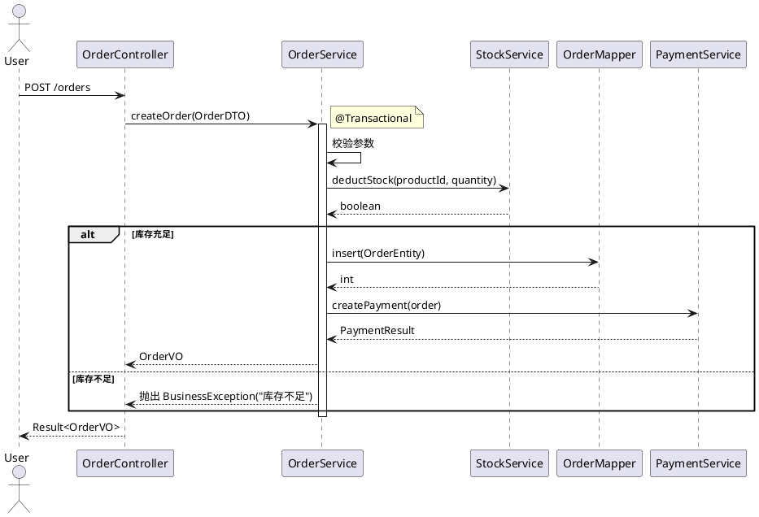

# 事务与流程设计模式

## 事务传播行为

| 传播行为 | 说明 | 使用场景 |
|---------|------|---------|
| **REQUIRED**（默认） | 如果当前没有事务，创建一个新事务；如果当前存在事务，就加入这个事务 | 常规业务操作 |
| **REQUIRES_NEW** | 无论当前是否存在事务，都会创建一个新事务（挂起当前事务） | 独立操作，不受外部事务影响（如支付回调、日志记录） |
| **SUPPORTS** | 如果当前存在事务，就加入；如果当前不存在事务，就以非事务方式执行 | 查询操作 |
| **NOT_SUPPORTED** | 以非事务方式执行，如果当前存在事务，就挂起当前事务 | 不需要事务的操作 |
| **MANDATORY** | 必须在一个已有的事务中执行，如果当前没有事务，就抛出异常 | 必须由调用方提供事务 |
| **NEVER** | 以非事务方式执行，如果当前存在事务，就抛出异常 | 严格禁止事务的操作 |

## 事务失效场景

| 场景 | 说明 | 解决方案 |
|------|------|---------|
| **同类方法调用** | `this.method()` 调用不经过代理 | 注入自身或使用 `AopContext.currentProxy()` |
| **异步方法** | `@Async` 方法在新线程执行 | 事务在异步线程中独立，需在异步方法上单独标注 |
| **非 public 方法** | `@Transactional` 仅对 public 生效 | 改为 public |
| **异常被捕获** | try-catch 吞掉异常，事务感知不到 | 抛出 RuntimeException 或指定 rollbackFor |
| **错误的异常类型** | 默认只回滚 RuntimeException | 指定 `rollbackFor = Exception.class` |

## 事务设计模板

### 需要事务的方法

```java
@Override
@Transactional(rollbackFor = Exception.class)
public OrderVO createOrder(OrderCreateDTO dto) {
    // 1. 保存订单
    // 2. 扣减库存
    // 3. 创建支付记录
    // 以上操作在同一事务中，任一失败全部回滚
}
```

### 不需要事务的方法

```java
@Override
public OrderVO getById(Long id) {
    // 纯查询操作
}
```

### 独立事务的方法

```java
@Override
@Transactional(propagation = Propagation.REQUIRES_NEW, 
               rollbackFor = Exception.class)
public void handlePayCallback(PayCallbackDTO dto) {
    // 支付回调需要独立事务
    // 避免外部事务影响支付结果处理
}
```

## 状态机设计模式

### 状态枚举定义

```java
@Getter
@AllArgsConstructor
public enum OrderStatus {
    PENDING_PAYMENT(0, "待支付"),
    PAID(1, "已支付"),
    SHIPPED(2, "已发货"),
    COMPLETED(3, "已完成"),
    CANCELLED(4, "已取消");
    
    private final Integer code;
    private final String desc;
    
    public boolean canTransferTo(OrderStatus target) {
        switch (this) {
            case PENDING_PAYMENT:
                return target == PAID || target == CANCELLED;
            case PAID:
                return target == SHIPPED;
            case SHIPPED:
                return target == COMPLETED;
            default:
                return false;
        }
    }
    
    public List<OrderStatus> getAllowedTargets() {
        return Arrays.stream(OrderStatus.values())
                .filter(this::canTransferTo)
                .collect(Collectors.toList());
    }
}
```

### 状态流转规则表

| 当前状态 | 允许流转到 | 触发条件 |
|---------|-----------|---------|
| 待支付 | 已支付 | 支付成功回调 |
| 待支付 | 已取消 | 用户取消 / 超时取消（延迟队列） |
| 已支付 | 已发货 | 商家发货 |
| 已发货 | 已完成 | 用户确认收货 / 自动确认 |

### 状态变更实现要点

1. 先查询当前状态
2. 校验状态流转合法性（`canTransferTo`）
3. 更新状态并记录日志
4. 异步发送状态变更通知（如需要）

## 时序图规范（PlantUML）



## 注意事项

- 事务边界要明确，避免大事务
- 异步操作要考虑事务提交后再执行
- 状态变更要记录日志，便于问题排查
- 时序图使用 PlantUML 格式，便于版本控制
- 状态机必须定义流转规则，避免非法状态变更
