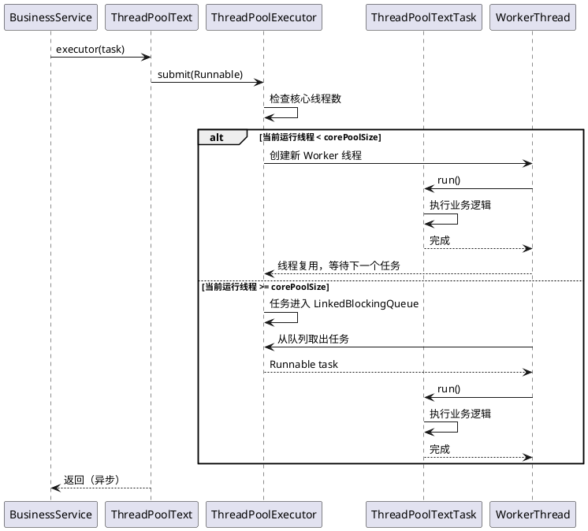

# 组件手册：自定义线程池封装组件（ThreadPoolExecutor Wrapper）

## 1. 组件概述

### 1.1 功能描述

本组件是一个基于 Java `ThreadPoolExecutor` 的轻量级线程池封装方案，专为 Spring Boot 应用提供统一的异步任务执行能力。核心功能包括：

- **动态线程池大小计算**：根据运行环境 CPU 核心数自动计算线程池大小（默认取核心数的 30%，保底 2 个线程）
- **命名线程工厂**：为线程池中的每个线程赋予可读性名称，便于日志追踪和问题排查
- **优雅关闭机制**：通过 JVM ShutdownHook 在应用停止时自动关闭线程池，防止任务丢失
- **静态任务提交入口**：提供简洁的静态方法向线程池提交 `Runnable` 任务

### 1.2 技术特征

| 特征 | 说明 |
|------|------|
| 设计模式 | Singleton（单例线程池）、Factory（线程工厂） |
| 拒绝策略 | `CallerRunsPolicy` — 当线程池和队列满时，由提交任务的线程自己执行 |
| 线程保活 | 60 分钟（corePoolSize == maximumPoolSize，固定大小线程池） |
| 任务队列 | `LinkedBlockingQueue`（无界队列，默认容量 `Integer.MAX_VALUE`） |
| 线程属性 | 非守护线程、正常优先级（`Thread.NORM_PRIORITY`） |

### 1.3 适用场景

- 需要批量异步处理任务的离线计算场景
- 需要控制并发度的外部 API 调用场景
- 需要统一管理线程生命周期的后台任务场景
- 不适合：高并发低延迟的 Web 请求处理（应使用 Spring 内置 `@Async` + `ThreadPoolTaskExecutor`）

---

## 2. 架构设计

### 2.1 包结构（规范化后）

```
com.xxx.common.threadpool
├── config/
│   └── ThreadPoolConfig.java          # 线程池配置属性类（@ConfigurationProperties）
├── core/
│   ├── ThreadPoolManager.java         # 线程池管理器（Singleton）
│   ├── NamedThreadFactory.java        # 命名线程工厂
│   └── TaskExecutor.java              # 任务提交入口（静态工具类）
├── task/
│   └── AbstractAsyncTask.java         # 异步任务抽象基类（去业务耦合后）
└── handler/
    └── TaskExceptionHandler.java      # 任务异常处理接口（扩展点）
```

### 2.2 分层映射

| 层 | 源文件 | 规范化后类名 | 职责 | 是否核心 |
|----|--------|-------------|------|---------|
| Config | — | `ThreadPoolConfig` | 外部化线程池参数 | 是 |
| Core | `ThreadPoolText` | `ThreadPoolManager` | 线程池创建、生命周期管理、任务提交 | 是 |
| Core | `ThreadPoolTextThreadFactory` | `NamedThreadFactory` | 自定义线程命名与属性 | 是 |
| Task | `ThreadPoolTextTask` | `AbstractAsyncTask` | 异步任务抽象封装 | 是 |
| Handler | — | `TaskExceptionHandler` | 任务执行异常处理（扩展点） | 否 |

### 2.3 设计模式说明

- **单例模式（Singleton）**：`ThreadPoolManager` 通过静态初始化块确保全局唯一线程池实例
- **工厂模式（Factory）**：`NamedThreadFactory` 实现 `ThreadFactory` 接口，统一控制线程创建逻辑
- **模板方法模式（Template Method）**：`AbstractAsyncTask` 可设计为抽象类，定义任务执行骨架，子类实现具体业务逻辑

---

## 3. 类与接口清单

### 3.1 核心类

| 类名 | 类型 | 源文件 | 职责 |
|------|------|--------|------|
| `ThreadPoolText` | Class | `ThreadPoolText.java` | 线程池单例管理器，提供 `executor()` 静态方法 |
| `ThreadPoolTextThreadFactory` | Class | `ThreadPoolTextThreadFactory.java` | 线程工厂，线程名前缀为 `check_duplicate--thread-` |
| `ThreadPoolTextTask` | Class | `ThreadPoolTextTask.java` | Runnable 任务封装，持有 `ITestService` 和 `id` |

### 3.2 演示/业务耦合类

| 类名 | 类型 | 源文件 | 职责 |
|------|------|--------|------|
| `Cs` | Controller | `controller/Cs.java` | REST 接口 `/cs/cs`，返回硬编码 OCR JSON |
| `OcrRequest` | DTO | `controller/OcrRequest.java` | OCR 请求参数（`app_id`, `session_id`, `image`） |
| `ITestService` | Interface | `service/ITestService.java` | 测试服务接口（`test`, `cs` 方法） |
| `TestServiceImpl` | ServiceImpl | `service/impl/TestServiceImpl.java` | 测试服务实现，演示线程池任务提交 |

### 3.3 扩展点

| 扩展点 | 当前状态 | 复写建议 |
|--------|---------|---------|
| `ThreadPoolTextTask` 中的 `ITestService` | 硬编码业务接口依赖 | 改为泛型 `T` 或函数式接口 `Consumer<T>` |
| 线程池参数（`DEFAULT_THREAD_POOL_SIZE`, `DEFAULT_PROCESS_RATE`） | 硬编码常量 | 改为 `@ConfigurationProperties` 外部化配置 |
| 线程名前缀 | 硬编码 `"check_duplicate-"` | 改为 `${thread-pool.name-prefix}` 配置项 |
| 日志文本 | 硬编码 `"开始关闭审查任务线程池"` | 改为通用描述或配置化 |
| 拒绝策略 | 硬编码 `CallerRunsPolicy` | 改为可通过配置切换的策略枚举 |

---

## 4. 核心流程

### 4.1 线程池初始化流程

```
[JVM 类加载 ThreadPoolText]
    │
    ▼
[静态初始化块 static {}]
    │
    ├── 获取可用处理器数量 → Runtime.getRuntime().availableProcessors()
    │
    ├── 计算线程池大小 → floor(processors * 0.3)
    │   └── 若结果为 0，则使用保底值 2
    │
    ├── 创建 ThreadPoolExecutor
    │   ├── corePoolSize = 计算值
    │   ├── maximumPoolSize = 计算值
    │   ├── keepAliveTime = 60 MINUTES
    │   ├── workQueue = new LinkedBlockingQueue<>()
    │   ├── threadFactory = new ThreadPoolTextThreadFactory()
    │   └── rejectedExecutionHandler = new CallerRunsPolicy()
    │
    └── 注册 ShutdownHook
            └── 调用 EXECUTOR.shutdownNow()
```

### 4.2 任务提交流程（时序图）



### 4.3 JVM 关闭流程

```
[JVM 收到关闭信号]
    │
    ▼
[触发所有 ShutdownHook]
    │
    ▼
[ThreadPoolText ShutdownHook]
    │
    ├── 打印日志："开始关闭审查任务线程池"
    │
    ├── 检查 !EXECUTOR.isShutdown()
    │   └── 调用 EXECUTOR.shutdownNow()
    │       └── 尝试中断所有正在执行的任务
    │       └── 清空等待队列，返回未执行的任务列表
    │
    └── 打印日志："审查任务线程池关闭结束 原始积累"
```

### 4.4 事务边界

本组件不涉及数据库事务。任务在独立的 Worker 线程中执行，若任务内部涉及数据库操作，需自行管理事务（`@Transactional` 或编程式事务）。

**注意**：`shutdownNow()` 会中断正在执行的任务，但不会自动回滚任务内部的事务。若任务中的事务需要回滚，应在任务内部捕获 `InterruptedException` 并手动回滚。

---

## 5. 配置与依赖

### 5.1 外部 Maven 依赖

| 依赖 | 版本 | 必要性 | 说明 |
|------|------|--------|------|
| `spring-boot-starter-web` | 2.2.7.RELEASE | 间接 | Cs Controller 需要，核心线程池仅依赖 JDK |
| `lombok` | — | 开发便利 | 日志注解 `@Slf4j` 使用 |

> **核心线程池组件纯 JDK 实现，零外部依赖**。仅演示代码依赖 Spring Web 和 Lombok。

### 5.2 内部依赖

| 被依赖方 | 依赖方 | 说明 |
|---------|--------|------|
| `ThreadPoolText` | `TestServiceImpl` | 测试服务调用线程池提交任务 |
| `ThreadPoolTextTask` | `TestServiceImpl` | 测试服务创建任务实例 |
| `ThreadPoolTextThreadFactory` | `ThreadPoolText` | 线程池创建时使用 |
| `ITestService` | `ThreadPoolTextTask` | **强业务耦合** |

### 5.3 配置属性（规范化后建议）

```yaml
# application.yml
thread-pool:
  # 线程池大小计算：保底线程数
  core-size: 2
  # CPU 核心数乘数（0.3 表示 30%）
  cpu-ratio: 0.3
  # 线程保活时间（分钟）
  keep-alive-minutes: 60
  # 线程名前缀
  name-prefix: "async-task-"
  # 拒绝策略：CALLER_RUNS / ABORT / DISCARD / DISCARD_OLDEST
  rejection-policy: CALLER_RUNS
```

---

## 6. 业务耦合清单

| ID | 位置（类:方法:行号） | 耦合类型 | 当前值 | 影响范围 | 脱敏建议 |
|----|---------------------|---------|--------|---------|---------|
| C01 | `ThreadPoolText.java:43-47` | 硬编码日志文本 | `"开始关闭审查任务线程池"` / `"审查任务线程池关闭结束 原始积累"` | 日志输出 | 改为 `"Shutting down thread pool"` / `"Thread pool shutdown complete"` |
| C02 | `ThreadPoolTextThreadFactory.java:27` | 硬编码线程名前缀 | `"check_duplicate-"` | 线程命名 | 改为 `"${thread-pool.name-prefix}"`，默认 `"async-task-"` |
| C03 | `ThreadPoolTextTask.java:18` | 强耦合业务接口 | `ITestService testService` | 任务定义 | 改为泛型参数或 `java.util.function.Consumer<T>` |
| C04 | `ThreadPoolTextTask.java:22-26` | 业务构造函数参数 | `(ITestService, String id)` | 任务创建 | 改为 `(Runnable action, T context)` |
| C05 | `ThreadPoolTextTask.java:30-33` | 硬编码日志文本 | `"开始........"` / `"结束........"` | 日志输出 | 删除或改为有意义的描述 |
| C06 | `Cs.java:23` | 无意义类名 | `Cs` | Controller | 移除（非组件核心） |
| C07 | `Cs.java:28` | 硬编码请求路径 | `"/cs"` | REST API | 移除（非组件核心） |
| C08 | `Cs.java:30` | 硬编码业务 JSON | OCR 响应 JSON 字符串 | 响应体 | 移除（非组件核心） |
| C09 | `OcrRequest.java:22-24` | OCR 业务字段 | `app_id`, `session_id`, `image` | DTO | 移除（非组件核心） |
| C10 | `ITestService.java:13-15` | 无意义方法名 | `test()`, `cs()` | 接口定义 | 移除（非组件核心） |
| C11 | `TestServiceImpl.java:23-24` | 硬编码日志文本 | `"当前id为："` | 日志输出 | 移除（非组件核心） |
| C12 | `TestServiceImpl.java:28-39` | 演示业务逻辑 | 循环 10 次提交任务 | 服务实现 | 移除（非组件核心） |

---

## 7. 敏感数据清单

| ID | 位置 | 敏感类型 | 当前值 | 处理方式 |
|----|------|---------|--------|---------|
| — | — | — | — | 本组件范围内 **无敏感数据** |

> 经全面审查，threadpoolexecutor 包内 7 个文件均未发现密码、密钥、Token、内部 URL、IP 白名单、数据库连接串等敏感信息。唯一接近敏感的是 `Cs.java:30` 中的硬编码 JSON，但内容为模拟 OCR 响应的占位符数据（`xxxxx`），不含真实敏感信息。

---

## 8. 脱敏与复写指导

### 8.1 命名映射表

| 源文件 | 源类名 | 复写后类名 | 命名理由 |
|--------|--------|-----------|---------|
| `ThreadPoolText.java` | `ThreadPoolText` | `ThreadPoolManager` | 消除无意义命名，明确职责为管理器 |
| `ThreadPoolTextThreadFactory.java` | `ThreadPoolTextThreadFactory` | `NamedThreadFactory` | 去业务前缀，保留核心能力描述 |
| `ThreadPoolTextTask.java` | `ThreadPoolTextTask` | `AbstractAsyncTask<T>` | 抽象化为泛型任务基类 |
| — | — | `TaskExecutor` | 新增静态工具类，替代原 `executor()` 静态方法 |
| — | — | `ThreadPoolConfig` | 新增配置属性类，外部化参数 |

### 8.2 抽象化策略

#### 策略 1：任务去业务耦合（核心）

**原代码：**
```java
public class ThreadPoolTextTask implements Runnable {
    private final ITestService testService;
    private final String id;
    
    @Override
    public void run() {
        testService.test(id);
    }
}
```

**复写后：**
```java
public abstract class AbstractAsyncTask<T> implements Runnable {
    protected final T context;
    
    protected AbstractAsyncTask(T context) {
        this.context = context;
    }
    
    @Override
    public void run() {
        try {
            execute(context);
        } catch (Exception e) {
            handleException(e, context);
        }
    }
    
    protected abstract void execute(T context);
    
    protected void handleException(Exception e, T context) {
        // 默认异常处理，可覆盖
    }
}
```

#### 策略 2：参数配置外化

**原代码：**
```java
private static final int DEFAULT_THREAD_POOL_SIZE = 2;
private static final double DEFAULT_PROCESS_RATE = 0.3;
```

**复写后：**
```java
@Data
@ConfigurationProperties(prefix = "thread-pool")
@Component
public class ThreadPoolConfig {
    private Integer coreSize = 2;
    private Double cpuRatio = 0.3;
    private Long keepAliveMinutes = 60L;
    private String namePrefix = "async-task-";
    private RejectionPolicy rejectionPolicy = RejectionPolicy.CALLER_RUNS;
}
```

#### 策略 3：线程池管理器 Spring 化

**原代码：**
```java
public class ThreadPoolText {
    private static final ThreadPoolExecutor EXECUTOR;
    static { EXECUTOR = new ThreadPoolExecutor(...); }
    public static void executor(ThreadPoolTextTask task) { EXECUTOR.submit(task); }
}
```

**复写后：**
```java
@Component
@Slf4j
public class ThreadPoolManager implements DisposableBean {
    private final ThreadPoolExecutor executor;
    
    public ThreadPoolManager(ThreadPoolConfig config) {
        int poolSize = calculatePoolSize(config);
        this.executor = new ThreadPoolExecutor(
            poolSize, poolSize,
            config.getKeepAliveMinutes(), TimeUnit.MINUTES,
            new LinkedBlockingQueue<>(),
            new NamedThreadFactory(config.getNamePrefix()),
            config.getRejectionPolicy().toHandler()
        );
    }
    
    public void submit(Runnable task) { executor.submit(task); }
    
    @Override
    public void destroy() {
        log.info("Shutting down thread pool...");
        if (!executor.isShutdown()) {
            executor.shutdownNow();
        }
    }
    
    private int calculatePoolSize(ThreadPoolConfig config) {
        int processors = Runtime.getRuntime().availableProcessors();
        int size = (int) Math.floor(processors * config.getCpuRatio());
        return Math.max(size, config.getCoreSize());
    }
}
```

### 8.3 配置外化清单

| 配置项 | 原硬编码值 | 复写后配置键 | 默认值 |
|--------|-----------|-------------|--------|
| 保底线程数 | `2` | `thread-pool.core-size` | `2` |
| CPU 乘数 | `0.3` | `thread-pool.cpu-ratio` | `0.3` |
| 保活时间 | `60`（分钟） | `thread-pool.keep-alive-minutes` | `60` |
| 线程名前缀 | `"check_duplicate-"` | `thread-pool.name-prefix` | `"async-task-"` |
| 拒绝策略 | `CallerRunsPolicy` | `thread-pool.rejection-policy` | `CALLER_RUNS` |

---

## 9. 使用指南

### 9.1 快速开始

**Step 1：引入组件**

将复写后的代码复制到目标项目的 `com.xxx.common.threadpool` 包下。

**Step 2：添加配置（可选）**

```yaml
thread-pool:
  core-size: 2
  cpu-ratio: 0.3
  name-prefix: "report-gen-"
```

**Step 3：定义业务任务**

```java
@Component
@RequiredArgsConstructor
public class ReportGenerationTask extends AbstractAsyncTask<ReportRequest> {
    private final ReportService reportService;
    
    @Override
    protected void execute(ReportRequest request) {
        reportService.generate(request);
    }
    
    @Override
    protected void handleException(Exception e, ReportRequest request) {
        log.error("报表生成失败，requestId：{}", request.getId(), e);
    }
}
```

**Step 4：提交任务**

```java
@Service
@RequiredArgsConstructor
public class OrderService {
    private final ThreadPoolManager threadPoolManager;
    private final ReportGenerationTask reportTask;
    
    public void asyncGenerateReport(ReportRequest request) {
        threadPoolManager.submit(new AbstractAsyncTask<ReportRequest>(request) {
            @Override
            protected void execute(ReportRequest ctx) {
                reportService.generate(ctx);
            }
        });
    }
}
```

### 9.2 配置说明

| 配置项 | 类型 | 必填 | 默认值 | 说明 |
|--------|------|------|--------|------|
| `thread-pool.core-size` | Integer | 否 | `2` | 线程池保底大小 |
| `thread-pool.cpu-ratio` | Double | 否 | `0.3` | CPU 核心数乘数 |
| `thread-pool.keep-alive-minutes` | Long | 否 | `60` | 线程空闲保活时间 |
| `thread-pool.name-prefix` | String | 否 | `"async-task-"` | 线程名前缀 |
| `thread-pool.rejection-policy` | Enum | 否 | `CALLER_RUNS` | 拒绝策略 |

### 9.3 扩展示例

#### 扩展 1：自定义拒绝策略

```java
@Component
public class LoggingAbortPolicy implements RejectedExecutionHandler {
    @Override
    public void rejectedExecution(Runnable r, ThreadPoolExecutor executor) {
        log.error("任务被拒绝，当前活跃线程：{}", executor.getActiveCount());
        throw new RejectedExecutionException("Task rejected");
    }
}
```

#### 扩展 2：任务执行超时控制

```java
public class TimeoutAsyncTask<T> extends AbstractAsyncTask<T> {
    private final long timeoutMillis;
    
    @Override
    protected void execute(T context) {
        Future<?> future = executor.submit(() -> doExecute(context));
        try {
            future.get(timeoutMillis, TimeUnit.MILLISECONDS);
        } catch (TimeoutException e) {
            future.cancel(true);
            throw new TaskTimeoutException(e);
        }
    }
}
```

---

## 10. 附录

### 10.1 源文件清单

| 序号 | 相对路径 | 行数 | 说明 |
|------|---------|------|------|
| 1 | `solutions/threadpoolexecutor/ThreadPoolText.java` | 55 | 线程池管理器 |
| 2 | `solutions/threadpoolexecutor/ThreadPoolTextTask.java` | 36 | 任务封装类 |
| 3 | `solutions/threadpoolexecutor/ThreadPoolTextThreadFactory.java` | 44 | 线程工厂 |
| 4 | `solutions/threadpoolexecutor/controller/Cs.java` | 36 | OCR 演示控制器 |
| 5 | `solutions/threadpoolexecutor/controller/OcrRequest.java` | 26 | OCR 请求 DTO |
| 6 | `solutions/threadpoolexecutor/service/ITestService.java` | 17 | 测试服务接口 |
| 7 | `solutions/threadpoolexecutor/service/impl/TestServiceImpl.java` | 41 | 测试服务实现 |

### 10.2 依赖树

```
threadpoolexecutor (核心)
├── JDK
│   ├── java.util.concurrent.ThreadPoolExecutor
│   ├── java.util.concurrent.LinkedBlockingQueue
│   ├── java.util.concurrent.ThreadFactory
│   └── java.util.concurrent.atomic.AtomicInteger
└── 演示代码额外依赖
    ├── spring-boot-starter-web
    └── lombok
```

### 10.3 已知问题与改进建议

| 问题 | 严重程度 | 建议 |
|------|---------|------|
| 使用无界队列 `LinkedBlockingQueue` | 中 | 高负载下可能导致 OOM，建议改为有界队列并配合自定义拒绝策略 |
| `shutdownNow()` 强制中断任务 | 中 | 若任务不可中断，可能导致线程无法退出；建议改为 `shutdown()` + 等待超时后再 `shutdownNow()` |
| 静态类难以单元测试 | 中 | 复写为 Spring Bean，支持 Mock 注入 |
| 无任务执行统计/监控 | 低 | 建议集成 Micrometer 暴露线程池活跃线程、队列大小等指标 |
| 无异常处理机制 | 高 | 任务抛异常仅由线程池捕获，建议增加统一异常处理器 |

### 10.4 变更历史

| 版本 | 日期 | 变更内容 |
|------|------|---------|
| v1.0 | 2026-05-14 | 初始萃取，完成 Component Manual |
