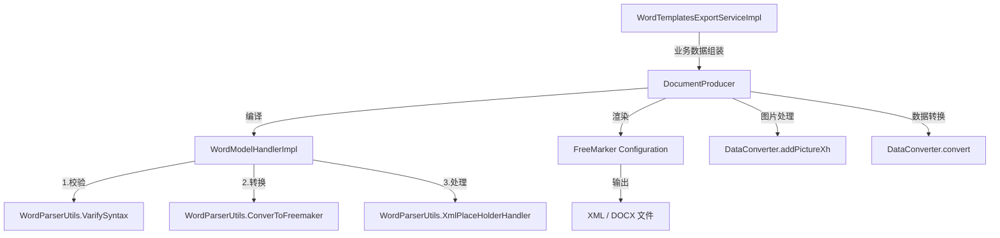

# Component Manual v1.0 — Word 模板导出引擎

## 1. 组件概述

**组件名称**：Word 模板导出引擎（Word Template Export Engine）

**定位**：基于 FreeMarker + dom4j 的 Word/XML 文档模板渲染与导出框架，支持 `.docx` 与 `.xml` 双格式模板，内置自定义占位符语法、图片嵌入、列表循环、条件判断、分页控制等能力。

**业务用途**：在本项目中用于生成「委托单 FA / 委托单 RA」等业务表单的 Word/PDF 导出。

---

## 2. 核心架构



**分层说明**：
| 层级 | 包路径 | 职责 |
|------|--------|------|
| 接口层 | `controller` | REST API 入口 |
| 业务层 | `service` / `service/impl` | 业务数据查询、映射、编排 |
| 引擎层 | `officeExport/datahandle` | 模板编译、数据转换、FreeMarker 配置 |
| 解析层 | `officeExport/word` | Word XML 解析、占位符处理、语法校验 |
| 基础层 | `officeExport/basic` | 占位符定义、异常、模型处理器接口 |
| 工具层 | `officeExport/utils` | 文件、字符串、Zip、Base64、JSON 工具 |

---

## 3. 类清单与职责（共 20 个）

| # | 类名 | 类型 | 职责 |
|---|------|------|------|
| 1 | `WordTemplatesExportController` | CODE | 业务 Controller，接收导出请求 |
| 2 | `WordTemplatesExportService` | CODE | 业务 Service 接口 |
| 3 | `WordTemplatesExportServiceImpl` | CODE | 业务实现：FA/RA 数据查询、映射、二维码生成、PDF 转换 |
| 4 | `WordTemplatesExportParams` | CODE | 导出请求入参 |
| 5 | `DocumentProducer` | **COMPONENT** | 核心入口：模板编译 + 文档生成 + 图片处理 + docx 打包 |
| 6 | `WordModelHandlerImpl` | **COMPONENT** | 模板处理三阶段：校验 → FreeMarker 转换 → 标签处理 |
| 7 | `WordModelParser` | **COMPONENT** | 门面类，聚合 WordModelHandlerImpl 三阶段 |
| 8 | `WordParserUtils` | **COMPONENT** | XML 解析工具集：占位符整合、列表转换、条件判断、图片占位、换行处理、语法校验 |
| 9 | `ModelHandler` | **COMPONENT** | 模板处理器接口 |
| 10 | `PlaceHolder` | **COMPONENT** | 占位符字符集定义与转义工具 |
| 11 | `SyntaxException` | **COMPONENT** | 模板语法异常 |
| 12 | `DataConverter` | **COMPONENT** | 数据对象 → Map 转换（Gson 自定义适配器），支持图片序号注入 |
| 13 | `DataHandler` | **COMPONENT** | 数据自定义处理接口 |
| 14 | `Config` | **COMPONENT** | 数据转换配置上下文（ThreadLocal） |
| 15 | `GlobalConfItemEnum` | **COMPONENT** | 全局配置项枚举（日期/布尔/数字格式） |
| 16 | `FMConfiguration` | **COMPONENT** | FreeMarker Configuration 单例管理、多路径模板加载器 |
| 17 | `FileUtils` | **COMPONENT** | 文件读写、Base64 图片转换、目录删除 |
| 18 | `StringUtil` | **COMPONENT** | 字符串工具：子串提取、不可见字符清理 |
| 19 | `ZipUtils` | **COMPONENT** | 基于 zip4j 的目录压缩 |
| 20 | `dom4jUtils` | **COMPONENT** | dom4j 元素同级插入工具 |

---

## 4. 关键流程时序

### 4.1 模板编译流程（Complie）

```
DocumentProducer.Complie(xmlPath, xmlModelName, debugModel)
  ├── 判断后缀：docx → 解压到临时目录，定位 document.xml
  ├── WordModelHandlerImpl.WordXmlModelHandle(xmlPath, actualModelPath)
  │     ├── VerifyModel：语法校验 + 清空图片占位内容 + 转义处理
  │     ├── ConverToFreemaker：占位符整合 → 列表/条件标签转换 → docx 图片引用处理
  │     └── XmlPlaceHolderHandler：If/List/Brace 标签字符串替换
  └── 返回 .ftl 编译后路径
```

### 4.2 文档生成流程（produce）

```
DocumentProducer.produce(data, outputPath)
  ├── docx 模式：DataConverter.addPictureXh（注入 _xh 序号）
  ├── dealPicture：递归遍历 Map，Base64 → 图片文件 → 写入 [Content_Types].xml / document.xml.rels
  ├── DataConverter.convert：对象 → Gson → Map（支持自定义 DataHandler）
  ├── FreeMarker template.process：渲染 XML
  ├── 后处理：\n 换行拆分为 <w:br/> + 多 <w:t>
  └── docx 模式：ZipUtils.compress 重新打包
```

### 4.3 业务导出流程（wordTemplatesExport）

```
Controller → ServiceImpl
  ├── 参数校验（tempType / dataId）
  ├── 模板选择（FA.docx / RA.docx / RA-no.docx）
  ├── 业务数据查询（FA/RA 主表 + 子表 + 字典翻译）
  ├── 特殊字段映射（checkbox、单选框、条形码、二维码）
  ├── DocumentProducer 编译 + 生成 Word
  ├── LibreOffice（jodconverter）Word → PDF
  └── 文件流返回 + 临时文件清理
```

---

## 5. 外部依赖

| 依赖 | 用途 |
|------|------|
| `freemarker` | 模板引擎渲染 |
| `dom4j` | Word XML 解析与修改 |
| `zip4j` | docx 解压/压缩 |
| `gson` | 数据对象序列化/反序列化 |
| `commons-lang3` | 字符串工具 |
| `jodconverter` + LibreOffice | Word → PDF 转换 |
| `zxing` | 条形码/二维码生成 |
| `hutool` | BeanUtil 对象转换 |
| `MyBatis-Plus` | 业务数据查询 |
| `Spring Boot` | Web / IoC |

---

## 6. 配置项

| 配置项 | 说明 |
|--------|------|
| `hussar.docbase.officeHomeDir` | LibreOffice 安装目录（用于 PDF 转换） |
| 模板路径 | 运行时 `user.dir/wordExportTemplates/` |
| FreeMarker 版本 | `2.3.28`（FMConfiguration 硬编码） |
| 编码 | `UTF-8` |

---

## 7. 扩展点

| 扩展点 | 说明 |
|--------|------|
| `DataHandler` | 自定义数据转换处理器，在 `DataConverter.convert` 中按路径匹配执行 |
| `Config` | 通过 `setKeyHandler` / `setGlobalKeyHandler` 注册自定义处理器与全局格式 |
| `ModelHandler` | 可替换的模板处理策略接口 |
| 占位符语法 | 支持 `{}` 变量、`[*@*]` 段落列表、`[#@#]` 表格行列表、`{^ ^}` 图片、`~` 分页符 |

---

## 8. 使用示例（组件视角，已脱敏）

```java
// 1. 编译模板
DocumentProducer dp = new DocumentProducer("/template/path");
String ftlPath = dp.Complie("/template/path", "contract.docx", false);

// 2. 准备数据
Map<String, Object> data = new HashMap<>();
data.put("company", "XXX");
List<Map<String,String>> items = new ArrayList<>();
items.add(Map.of("name","item1","price","100"));
data.put("items", items);  // 对应 [*items@item* ... *items*]

// 3. 生成文档
dp.produce(data, "/output/contract.docx");
```

---

## 9. 业务耦合点与敏感数据

### 9.1 强业务耦合（需脱敏）

`WordTemplatesExportServiceImpl` 存在大量硬编码业务逻辑，**不可直接复用**：

| 耦合点 | 说明 |
|--------|------|
| `HmwWorkOrderFaMapper` / `HmwWorkOrderFaLedgerService` | FA 委托单业务数据查询 |
| `WtdjRATaskMapper` / `HmwOrderRaTestItem` | RA 委托单业务数据查询 |
| `ExpSchMapper` | 实验排期数据查询 |
| `VHmwUserTreeService` / `VDictInfoService` | 用户树、字典表翻译 |
| `checkboxAssy` / `checkboxTest` | 硬编码失效模式复选框选项 |
| `processPreprocessedData` / `processGeneralData` / `processOtherData` | RA 测试项目的硬编码分类与读点处理（TCT/PCT/HAST/UHAST 等） |
| `"李世杰"` | 硬编码人员姓名 |
| `generateBarCode` | 基于业务工单号生成条形码 |

### 9.2 敏感数据

- 无密码、密钥等硬编码敏感信息。
- 但包含业务人员姓名（如 `"李世杰"`）、业务字典编码（如 `hmw-sf(English)`、`hmw-wtdmd-ra` 等）。

---

## 10. 类型标记与复用建议

| 范围 | 类型标记 | 建议产物形式 |
|------|----------|--------------|
| `officeExport/**`（引擎层 + 解析层 + 基础层 + 工具层） | **COMPONENT** | 标准化为通用组件，放入 `components/word-template-export/` |
| `WordTemplatesExportController` / `Service` / `ServiceImpl` / `Params` | **CODE** | 作为使用示例片段存储，不生成文件 |
| `officeExport/test/Test.java` | **CODE** | 单元测试示例片段 |

**复用价值评估**：`officeExport` 引擎层具备高度复用价值，是一套轻量级「Word 模板 + FreeMarker」渲染框架；业务 ServiceImpl 仅为特定业务场景适配代码，需基于引擎重新编写。

---

## Phase 1 质量检查

| 检查项 | 结果 |
|--------|------|
| 10 章完整性 | 通过 |
| 类型标记（COMPONENT/CODE） | 已标注 |
| 耦合点识别 | 已识别 9 处强耦合 |
| 敏感数据检查 | 1 处硬编码人名 + 多处业务字典编码 |
| 类清单覆盖度 | 20/20，100% |
| 关键流程时序 | 3 条核心时序 |

---

**萃取日期**：2026-05-18
**萃取范围**：`com.jxdinfo.hussar.example.hmw.wordTemplatesExport` 及其子包
**类型标记**：COMPONENT（引擎层）+ CODE（业务层）
